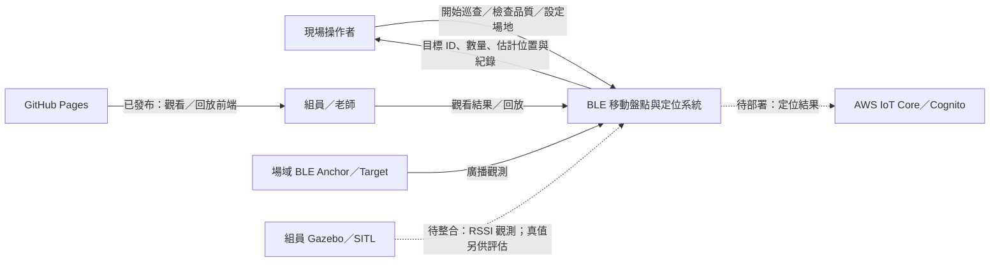

# 第一層：系統全景

```mermaid
flowchart LR
  Field["現場操作者"] -->|"開始巡查／檢查品質／設定場地"| System["BLE 移動盤點與定位系統"]
  Viewer["組員／老師"] -->|"觀看結果／回放"| System
  System -->|"目標 ID、數量、估計位置與紀錄"| Field
  Tags["場域 BLE Anchor／Target"] -->|"廣播觀測"| System
  Gazebo["組員 Gazebo／SITL"] -.->|"待整合：RSSI 觀測；真值另供評估"| System
  System -.->|"待部署：定位結果"| AWS["AWS IoT Core／Cognito"]
  GitHub["GitHub Pages"] -->|"已發布：觀看／回放前端"| Viewer
```

系統方塊刻意不展開內部模組，呈現使用者、輸入及外部服務。Anchor／Target 的實體封包驗證尚待刷機；AWS 箭頭為目標架構。
