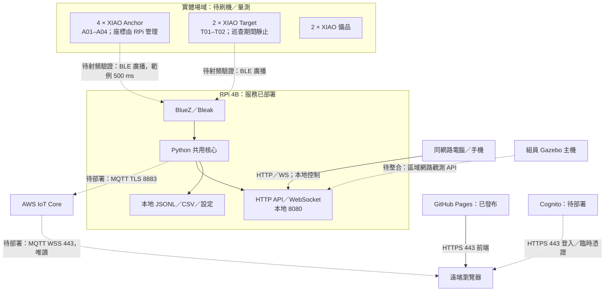

# 第二層：軟硬體部署與通訊

```mermaid
flowchart TB
  subgraph Field["實體場域：待刷機／量測"]
    Anchors["4 × XIAO Anchor\nA01–A04；座標由 RPi 管理"]
    Targets["2 × XIAO Target\nT01–T02；巡查期間靜止"]
    Spare["2 × XIAO 備品"]
  end
  subgraph Pi["RPi 4B：服務已部署"]
    BlueZ["BlueZ／Bleak"] --> Core["Python 共用核心"]
    Core --> Files["本地 JSONL／CSV／設定"]
    Core --> HTTP["HTTP API／WebSocket\n本地 8080"]
  end
  Anchors -.->|"待射頻驗證：BLE 廣播，範例 500 ms"| BlueZ
  Targets -.->|"待射頻驗證：BLE 廣播"| BlueZ
  Local["同網路電腦／手機"] -->|"HTTP／WS；本地控制"| HTTP
  Core -.->|"待部署：MQTT TLS 8883"| IoT["AWS IoT Core"]
  Pages["GitHub Pages：已發布"] -->|"HTTPS 443 前端"| Public["遠端瀏覽器"]
  Auth["Cognito：待部署"] -.->|"HTTPS 443 登入／臨時憑證"| Public
  IoT -.->|"待部署：MQTT WSS 443，唯讀"| Public
  Sim["組員 Gazebo 主機"] -.->|"待整合：區域網路觀測 API"| HTTP
```

本地開發 HTTP 介面不直接公開至網際網路；跨網路觀看走雲端加密連線。圖中列出的埠為本次設計，實際部署結果另由測試紀錄確認。
