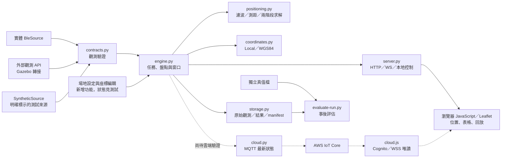

# 第三層：軟體技術棧與模組分工

```mermaid
flowchart LR
  BLE["實體 BleSource"] --> Contract["contracts.py\n觀測驗證"]
  External["外部觀測 API\nGazebo 轉接"] --> Contract
  Synthetic["SyntheticSource\n明確標示的測試來源"] --> Contract
  Contract --> Engine["engine.py\n任務、盤點與窗口"]
  Engine --> Solver["positioning.py\n濾波／測距／兩階段求解"]
  Engine --> Coord["coordinates.py\nLocal／WGS84"]
  Engine --> Store["storage.py\n原始觀測／結果／manifest"]
  Settings["場地設定與座標編輯\n新增功能，狀態見測試"] --> Engine
  Engine --> API["server.py\nHTTP／WS／本地控制"]
  API --> Front["瀏覽器 JavaScript／Leaflet\n位置、表格、回放"]
  Engine -.->|"尚待雲端驗證"| Cloud["cloud.py\nMQTT 最新狀態"]
  Cloud -.-> IoT["AWS IoT Core"]
  IoT -.-> AuthView["cloud.js\nCognito／WSS 唯讀"]
  AuthView -.-> Front
  Truth["獨立真值檔"] --> Evaluate["evaluate-run.py\n事後評估"]
  Store --> Evaluate
```

上述 Python 模組位於同一 RPi 服務程序，不把每個檔案誤畫成獨立微服務。儲存使用檔案；第一版沒有把 DynamoDB／EC2 當成已部署依賴。
