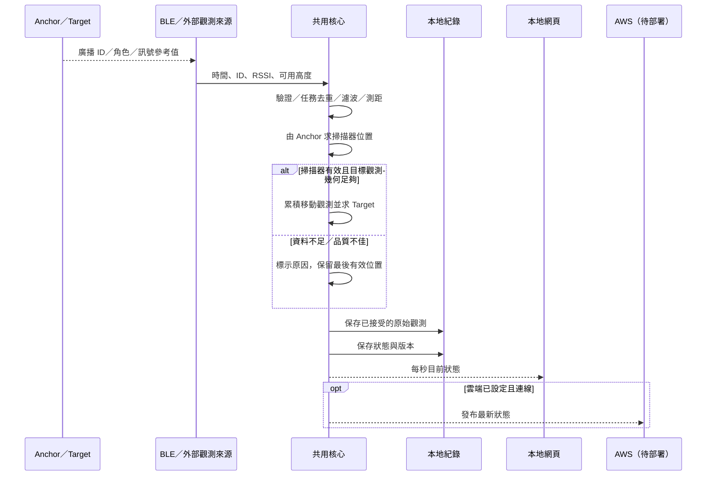
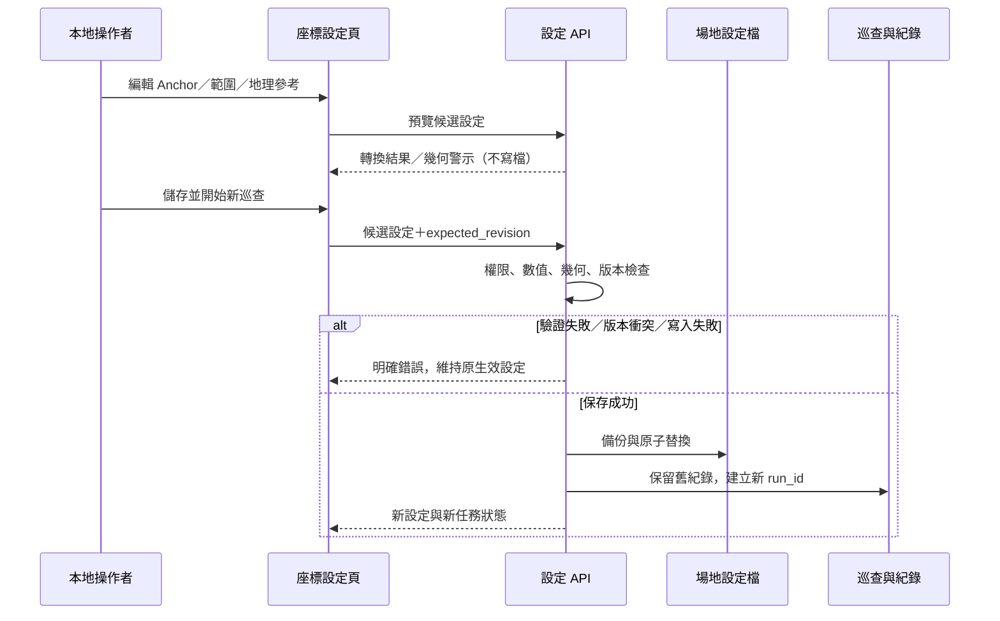

# 第四層：關鍵流程序列

## 巡查觀測與定位

```mermaid
sequenceDiagram
  participant Tag as Anchor／Target
  participant Input as BLE／外部觀測來源
  participant Core as 共用核心
  participant Store as 本地紀錄
  participant Web as 本地網頁
  participant Cloud as AWS（待部署）
  Tag-->>Input: 廣播 ID／角色／訊號參考值
  Input->>Core: 時間、ID、RSSI、可用高度
  Core->>Core: 驗證／任務去重／濾波／測距
  Core->>Core: 由 Anchor 求掃描器位置
  alt 掃描器有效且目標觀測幾何足夠
    Core->>Core: 累積移動觀測並求 Target
  else 資料不足／品質不佳
    Core->>Core: 標示原因，保留最後有效位置
  end
  Core->>Store: 保存已接受的原始觀測
  Core->>Store: 保存狀態與版本
  Core-->>Web: 每秒目前狀態
  opt 雲端已設定且連線
    Core-->>Cloud: 發布最新狀態
  end
```

## 座標設定切換（本地已驗證，RPi 新版待部署）

```mermaid
sequenceDiagram
  participant User as 本地操作者
  participant UI as 座標設定頁
  participant API as 設定 API
  participant File as 場地設定檔
  participant Run as 巡查與紀錄
  User->>UI: 編輯 Anchor／範圍／地理參考
  UI->>API: 預覽候選設定
  API-->>UI: 轉換結果／幾何警示（不寫檔）
  User->>UI: 儲存並開始新巡查
  UI->>API: 候選設定＋expected_revision
  API->>API: 權限、數值、幾何、版本檢查
  alt 驗證失敗／版本衝突／寫入失敗
    API-->>UI: 明確錯誤，維持原生效設定
  else 保存成功
    API->>File: 備份與原子替換
    API->>Run: 保留舊紀錄，建立新 run_id
    API-->>UI: 新設定與新任務狀態
  end
```

本地數值／API／桌面操作已通過 TEST-011、TEST-012；RPi 更新因 SSH 逾時尚未完成。最終報告須保留此部署差異，待現場複驗後再更新。
